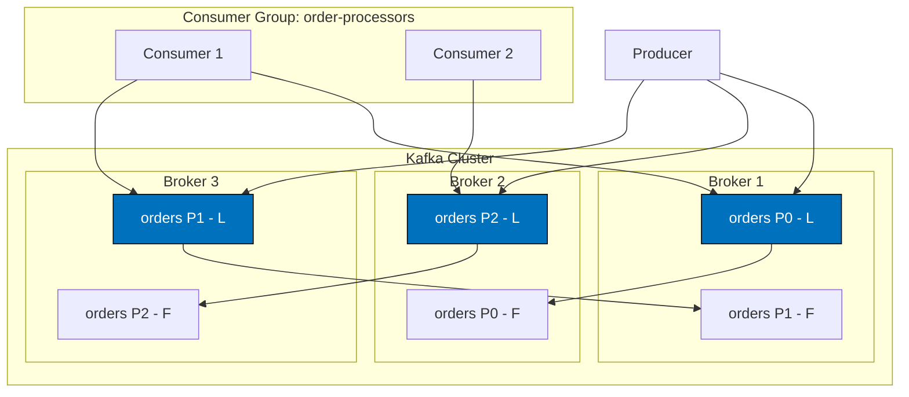

# Challenge: Kafka Architecture Concepts

## Overview
**Mode:** Conceptual (Design/Analysis)  
**Duration:** 1.5-2 hours  
**Difficulty:** Beginner to Intermediate

## Learning Objectives
By completing this exercise, you will:
- Demonstrate understanding of Kafka's core components
- Visualize the relationships between topics, partitions, and brokers
- Analyze how Kafka achieves fault tolerance and scalability

## Prerequisites
- Completed reading: All Monday written content
- Observed instructor demo: `demo_kafka_architecture`

---

## The Scenario

You have been asked to onboard a new team member who has never worked with Kafka. To ensure they understand the architecture before writing any code, you need to create educational materials that explain how Kafka works.

---

## Part 1: Concept Questions (30 minutes)

Answer the following questions in `templates/answers.md`. Each answer should be 2-4 sentences.

### Questions

1. **What is the difference between a topic and a partition?**

2. **Why might you choose to have multiple partitions for a single topic?**

3. **What is the role of ZooKeeper in a Kafka cluster? What is KRaft and how is it different?**

4. **Explain the difference between a leader replica and a follower replica.**

5. **What does ISR stand for, and why is it important for fault tolerance?**

6. **How does Kafka differ from traditional message queues like RabbitMQ?**

7. **What is the publish-subscribe pattern, and how does Kafka implement it?**

8. **What happens when a Kafka broker fails? How does the cluster recover?**

---

## Part 2: Architecture Diagram (45 minutes)

Using the template in `templates/architecture-diagram.mermaid`, create a diagram that shows:

### Required Elements:
1. **A Kafka cluster with 3 brokers**
2. **A topic called "orders" with 3 partitions**
3. **Replication factor of 2** (show which broker has leader vs follower for each partition)
4. **One producer** sending messages to the topic
5. **Two consumers** in a consumer group reading from the topic

### Diagram Requirements:
- Label each broker with an ID (1, 2, 3)
- Indicate which partitions each broker holds
- Mark leaders with [L] and followers with [F]
- Show the consumer group name

---

## Part 3: Failure Analysis (30 minutes)

In `templates/failure-analysis.md`, analyze the following scenario:

### Scenario:
Your Kafka cluster has 3 brokers. The "orders" topic has 3 partitions with replication factor 2:
- Partition 0: Leader on Broker 1, Follower on Broker 2
- Partition 1: Leader on Broker 2, Follower on Broker 3
- Partition 2: Leader on Broker 3, Follower on Broker 1

**Broker 2 suddenly crashes.**

Answer these questions:
1. Which partitions are affected?
2. What happens to Partition 0? (Where is its leader now?)
3. What happens to Partition 1? (Who becomes the new leader?)
4. Can producers still send messages to all partitions? Why or why not?
5. What is the cluster's replication status after the failure?

---

## Definition of Done

- [ ] All 8 concept questions answered in `templates/answers.md`
- [ ] Architecture diagram completed in `templates/architecture-diagram.mermaid`
- [ ] Failure analysis completed in `templates/failure-analysis.md`
- [ ] Diagram includes all required elements (3 brokers, partitions, replication, producer, consumers)
- [ ] Failure analysis addresses all 5 questions

---

## Submission

Ensure all three files in the `templates/` folder are completed:
1. `answers.md`
2. `architecture-diagram.mermaid`
3. `failure-analysis.md`

---

## Grading Rubric

| Criterion | Points |
|-----------|--------|
| Concept questions accurate and complete | 30 |
| Architecture diagram includes all elements | 30 |
| Diagram correctly shows leader/follower distribution | 15 |
| Failure analysis is thorough and accurate | 25 |
| **Total** | **100** |